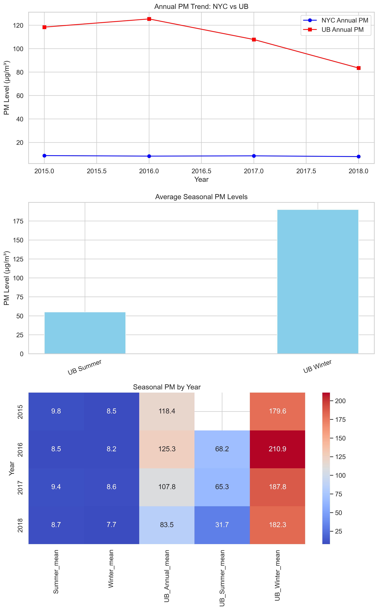

# NYC and Mongolia Air Pollution Analysis

## Overview
This project compares fine particulate matter (PM2.5) levels between **New York City (NYC)** and **Ulaanbaatar (UB)** using publicly available environmental monitoring data.  
The analysis explores long-term trends, seasonal differences, and includes a heatmap summarizing PM2.5 changes across several years.

## Research Question
How do PM2.5 levels in Ulaanbaatar and New York City differ, and what yearly or seasonal patterns can be observed in each city

## Folder Structure
- `data/` contains the raw files, intermediate cleaning steps, and combined datasets  
- `src/` includes Python scripts for data preparation and visualization  
- `visuals/` stores the exported charts and images  
- `README.md` provides an overview of the project  
- `LICENSE` lists the MIT licensing terms  
- `.gitignore` identifies files that are not tracked in version control  

## Visualization

### Comparative PM2.5 Analysis: NYC and Ulaanbaatar


## Description of Plots

1. **Annual PM Trend:**  
   This line chart shows the yearly average PM2.5 levels for both cities. New York City remains low and steady across the years, while Ulaanbaatar has much higher values and more variation.

2. **Seasonal Comparison:**  
   This bar chart shows average PM2.5 levels in Ulaanbaatar during summer and winter. Winter pollution is extremely high because many homes rely on coal for heating. Summer values are far lower.  
   New York City seasonal values do not appear in this chart because the dataset did not include NYC summer or winter columns.

3. **Heatmap:**  
   The heatmap combines annual and seasonal PM2.5 values for both cities. Darker colors represent higher pollution. The chart highlights the severe winter conditions in Ulaanbaatar and shows how values shift from year to year.

## Data Note
Some measurements are missing. For example, the summer 2015 PM value for Ulaanbaatar was not available in the source data. These gaps are common in environmental monitoring and should be considered when interpreting the results.

## Insights
- Ulaanbaatar's winter pollution is extremely high due to heating practices, temperature patterns, and the city's valley location.  
- New York City maintains far lower and more stable PM2.5 levels.  
- These differences can support future modeling work, public health research, or policy discussions about air quality.

## How to Run
1. Clone the repository:
   ```bash
   git clone https://github.com/mongol911/nyc-mongolia-air-pollution.git
